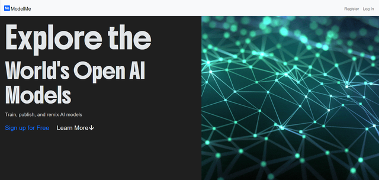

# ModelMe


## Table of Contents
- [About ModelMe](#about-modelme)
- [Installation and usage](#installation-and-usage)
- [Tech Stack](#tech-stack)
- [Features](#features)
- [Screenshots](#screenshots)
- [Inspiration](#inspiration)
- [Usage Examples](#usage-examples)
- [Future Improvements](#future-improvements)
- [Contributing](#contributing)
- [Contact](#contact)
- [Author](#author)
- [License](#license)

---
# About ModelMe

ModelMe is an open-source platform that allows users to create, train, and share image classification models directly in their browser. It is built using [Tensorflow.js](https://www.tensorflow.org/js), which makes it possible to train neural networks in JavaScript and run them efficiently on client machines. The backend is powered by [Flask](https://flask.palletsprojects.com/) and provides a simple yet robust environment for managing user accounts, storing model data, and serving trained models.

The project takes inspiration from [Google’s Teachable Machine](https://teachablemachine.withgoogle.com/), but it aims to extend functionality by adding a structured publishing system and a collaborative element. Instead of keeping models only on your own device, ModelMe lets you save and share them with other users, download existing models, or even build upon someone else’s work.

For styling, the project uses [Bootstrap](https://getbootstrap.com), ensuring the interface is clean and mobile-friendly. The database is managed with [SQLite3](https://sqlite.org/), which provides lightweight but reliable storage for users, models, and class metadata. ModelMe’s design goal is to remain lightweight, educational, and flexible so that students, hobbyists, and developers alike can experiment with machine learning without needing powerful hardware or complicated setups.

---
## Installation and usage

Setting up ModelMe locally is simple. The following steps assume that Python 3.9 or higher is installed on your machine:

> **Note**: ModelMe requires **Python 3.9+**

1. **Upgrade pip** to make sure you’re working with the latest version of the Python package manager:
   ```bash
   python3 -m pip install --upgrade pip
   ```
   Then install the required packages
    ```bash
    pip install -r requirements.txt
    ```
   And finally, you can run the project by simply following this  command in your project folder

    ```bash
    flask run
    ```
    ## Tech Stack
    - [Flask](https://flask.palletsprojects.com/) – Backend
    - [Tensorflow.js](https://www.tensorflow.org/js) – Model Training & Prediction
    - [Bootstrap](https://getbootstrap.com) – Frontend Styling
    - [SQLite3](https://sqlite.org/) – Database

    ## Features

    - Intuitive interface – A clean dashboard that allows anyone to manage projects without needing deep machine learning knowledge.

    - Multi-class support – Train models with several categories at once, making them versatile for many different applications.

    - Built-in publishing system – Share your model with others or browse the catalog of user-created models.

    - Model downloading – Export trained models for offline use, integration into other projects, or deployment on different platforms.

    - Lightweight and fast – Built with Tensorflow.js, training runs in-browser using GPU acceleration where available.

    - Educational focus – Designed to make machine learning concepts more approachable for students and hobbyists.


       ## Screenshots

       

       


     ### Inspiration
     ModelMe is heavily inspired by Google’s Teachable Machine. While Teachable Machine makes training models extremely easy, it lacks a structured way to              manage, publish, and collaborate on models. ModelMe fills this gap by combining simplicity with a more project-oriented approach.

     The motivation behind this project was to create a tool that could serve as a learning platform for beginners while still being powerful enough for                developers who want to experiment. By making the tool open-source, the project also encourages contributions and collaboration from the community.

     ### Usage Examples
     Here are some example scenarios where ModelMe could be useful:
     Educational projects – Students learning about neural networks can train a model on everyday objects using just their webcam.
     Hobby experiments – Makers and tinkerers can build small AI-driven applications without needing a dedicated ML backend.
     Prototype building – Developers can quickly test image classification ideas before moving to larger frameworks like TensorFlow or PyTorch.
     Creative use cases – Artists and designers can train models to recognize sketches, symbols, or even gestures.

     ### Future Improvements
     Improved dataset management with drag-and-drop upload.
     Support for additional model types beyond image classification.
     Real-time collaborative training sessions.
     Integration with cloud storage for saving and loading large datasets.
     A rating and feedback system for published models.
     ### Contributing
     Contributions are welcome! If you’d like to help improve ModelMe, you can fork the repository, create a new branch, and submit a pull request. Please ensure       your changes are well-documented and tested. For major changes, open an issue first to discuss what you would like to change.
     ### Contact
     For bugs, any other problems or further information you can contact me with: burakozyurt2010@gmail.com
     ### Author
     - [@Burak Özyurt](https://www.github.com/Burak-Ozyurt-17)

     ## License
     This project is licensed under the MIT License. See [LICENSE](LICENSE) for details.

